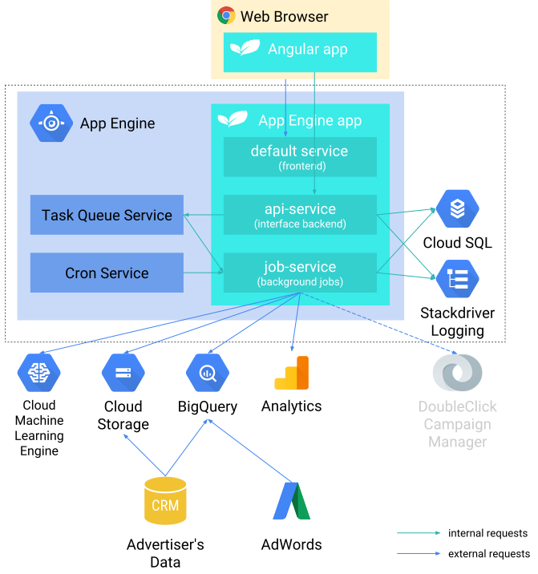

This document describes the CRMint architecture, to enable a better understanding of how it works, and also as a start point for customizing and contributing to the code base.

For more detail on pipelines, jobs, workers, and key concepts of what CRMint does, see the [Concepts](../guides/concepts.html) guide.

## Overview

CRMint is a [Google App Engine](https://cloud.google.com/appengine/) application, comprising of 3 *services*:

*   **Web application** - service name: `default`. The `default` service serves the static components that make up the CRMint user interface.
*   **[CRMint interface API](#crmint-interface-api)** - service name: `api-service`: This provides the means for the CRMint user interface to interact with the core CRMint application.
*   **CRMint Core** - service name `job-service`: This service performs the core actions of executing pipelines.

## Web application

The CRMint user interface is an Angular project, and can be found [here](https://github.com/google/crmint/tree/master/frontend).

## CRMint interface API

This service provides the means for the UI to interact with the CRMint core.

This includes:

*   General settings
*   Global variables
*   Pipeline definitions
*   Job definitions
*   Worker definitions
*   Task execution

The API is defined [here](https://github.com/google/crmint/tree/master/backends/ibackend).

## CRMint Core

The core CRMint service is defined [here](https://github.com/google/crmint/tree/master/backends/jbackend).
Through use of the Task Queue and Cron, the execution of pipelines is controlled.

Individual tasks, invoked from the Task Queue, interact with the relevant APIs e.g. Google Analytics, Cloud Storage etc.

Pipeline definitions and other settings are stored in the associated Cloud SQL instance.

